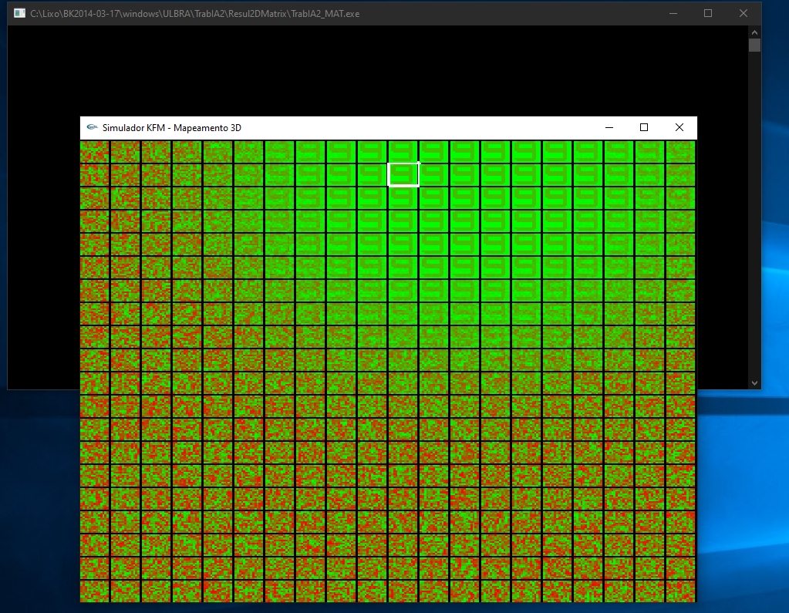
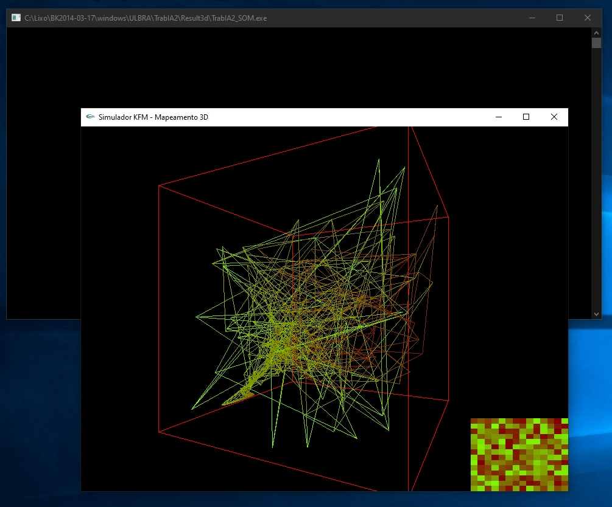
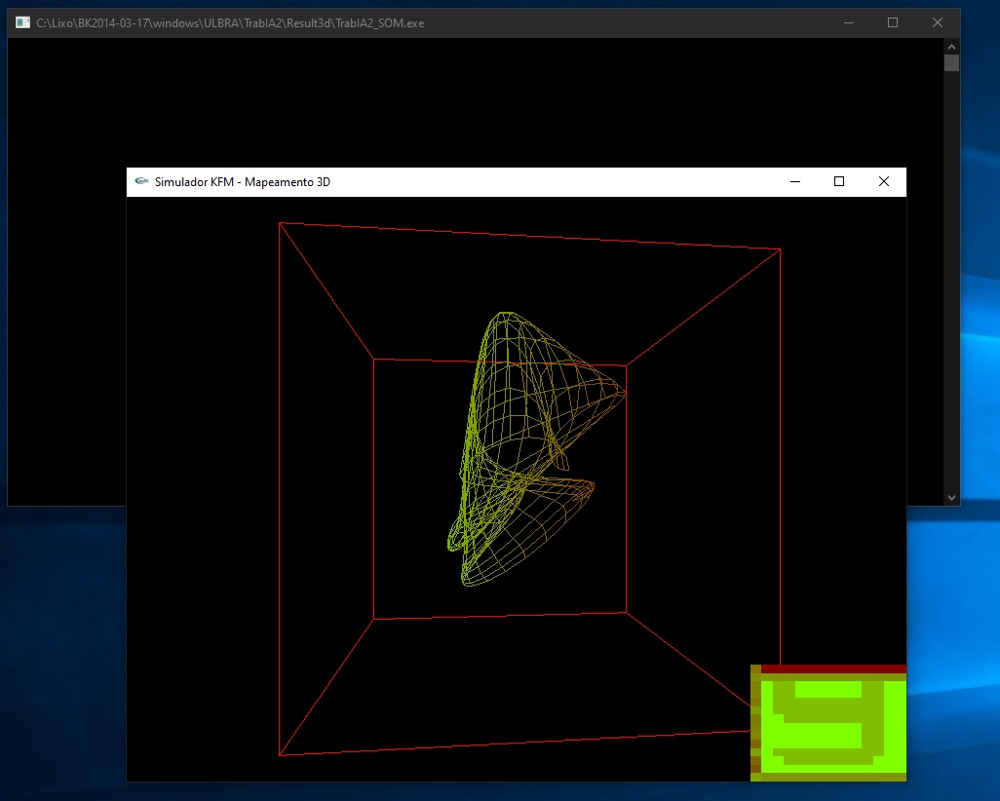

# NeuralNetwork To Patterns Recognition

This is a simple trying with Neural Network to Patterns_Recognition and a kind of OpenGL to viewing the process.

<table width:100%>
  <tr>
    <td></td>
    <td></td>
    <td></td>
  </tr>
</table>

"The neural approach applies biological concepts to machines to recognize patterns. The outcome of this effort is invention of artificial neural networks. A neural network is an information processing system. It consists of massive simple processing units with a high degree of interconnection between each unit"

